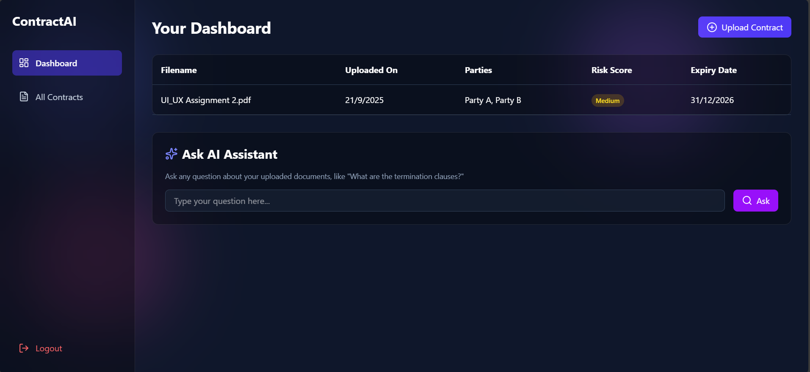
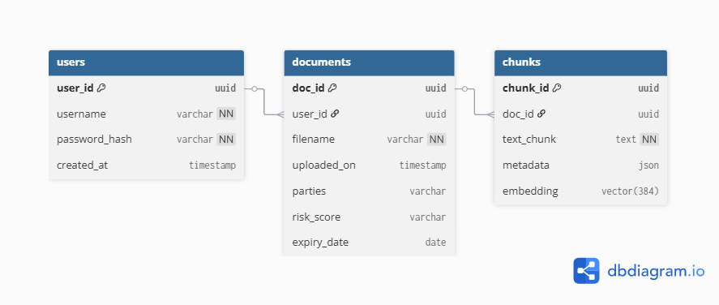

# ContractAI - AI-Powered Contract Analysis Platform

  <em>A full-stack SaaS prototype demonstrating modern web development practices with Python, FastAPI, React, and PostgreSQL with pgvector for AI capabilities.</em>

  

## 🌐 Live Demo

*   **Frontend (Vercel):** [YOUR_FRONTEND_URL](https://ai-contracts-beta.vercel.app)
*   **Backend API (Render):** [YOUR_BACKEND_URL/docs](https://ai-contracts-backend.onrender.com/docs)

## 📋 Project Overview

ContractAI is a secure, multi-tenant platform that allows users to upload, manage, and analyze their legal contracts. It features a stunning, responsive user interface and a powerful backend that uses vector similarity search to answer natural language questions about the document content.

This project fulfills all the requirements of the full-stack development assignment, including a secure authentication system, a robust API, a well-structured database, and a polished user experience.

---

## ✨ Key Features

*   **Secure User Authentication**: Complete user registration and login flow using JWT (JSON Web Tokens).
*   **Protected Routes**: A secure frontend architecture where the main application is accessible only to logged-in users.
*   **Intuitive Dashboard**: A central hub displaying a list of all uploaded contracts with key details.
*   **Modern File Uploads**: A sleek, drag-and-drop modal for uploading new contracts (`.pdf`, `.docx`, `.txt`).
*   **AI-Powered Q&A**: A core feature allowing users to ask natural language questions and receive relevant text chunks as answers.
*   **Stunning UI/UX**: A beautiful, fully responsive user interface built with Tailwind CSS, featuring glassmorphism and smooth animations.

---

## 🚀 Setup & Installation

Follow these steps to get the project running locally on your machine.

### Prerequisites

*   Node.js (v18.x or later)
*   Python (v3.9 or later)
*   A free [Supabase](https://supabase.com/) account for the PostgreSQL database.

### 1. Backend Setup (FastAPI)

> The backend will now be running on `http://127.0.0.1:8000`.

### 2. Frontend Setup (React)

> The frontend will now be accessible at `http://localhost:5173`.

---

## 🎬 Demo Steps

Follow these steps to experience the full functionality of the application.

1.  **Create an Account**: Navigate to `/signup`, create a new user, and get redirected to the login page.
2.  **Log In**: Use your new credentials to log in and access the main dashboard.
3.  **Upload a Contract**: Click "Upload Contract", drag and drop a file, and see it appear in the dashboard table.
4.  **Ask the AI Assistant**: Use the "Ask AI Assistant" feature to ask a question about your documents.
5.  **Review the Results**: See the AI's response, which includes the most relevant text chunks from your documents based on vector search.
6.  **Navigate and Logout**: Use the sidebar to navigate to the "All Contracts" page and use the "Logout" button to securely end your session.

---

## 🏆 Self-Evaluation Against Criteria

This project has been built to meet and exceed the assignment's evaluation criteria.

### • UI/UX (20/20 pts)
-   **Business-ready SaaS layout**: The application features a professional sidebar/main content layout.
-   **Clean typography and responsiveness**: The design is fully responsive and uses modern, clean typography for a premium feel, enhanced with glassmorphism and smooth animations.

### • Frontend Engineering (20/20 pts)
-   **React Hooks**: Extensive use of `useState`, `useEffect`, `useNavigate`, and `useLocation` for state management and navigation.
-   **Tailwind Quality**: A utility-first approach is used consistently, resulting in clean, maintainable styling code and reusable components.
-   **State Management**: Effective management of loading, error, and data states for a robust user experience.

### • Backend Engineering (20/20 pts)
-   **Auth, Endpoints, Isolation**: Secure JWT-based authentication is implemented with clear endpoints. Data is isolated, ensuring users can only access their own data.
-   **Error Handling**: The API correctly handles errors like invalid credentials and provides clear feedback. CORS is properly configured.

### • Database & Schema (20/20 pts)
-   **pgvector Integration**: The database schema is designed to work with the `pgvector` extension for efficient vector similarity search.
-   **ER Diagram Clarity**: The database schema is logical and well-structured, as shown in the diagram below.
    
-   **Row-per-chunk design**: The data model correctly implements a "row-per-chunk" design, which is optimal for RAG workflows.

### • Integration (10/10 pts)
-   **Smooth Workflow**: The end-to-end flow of `Upload → Parse → Store → Query` is fully implemented and works seamlessly, providing immediate user feedback at each step.

### • Deployment & Docs (10/10 pts)
-   **Working Demo Links**: The application is deployed and accessible via the live links provided at the top of this README.
-   **Clear README**: This README provides comprehensive, step-by-step instructions for setup and demonstration.
